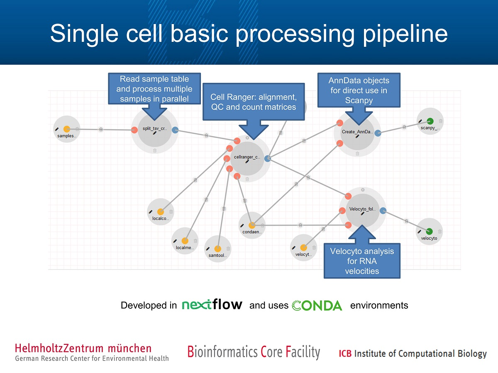

# Description

The single cell data for the Lung Cell Atlas is generated in a wide variety of centers, at different moments in time, and the data has been preprocessed in different manners so far (different software and versions etc.).  
For the comprehensive analysis of the Lung Cell Atlas datasets, the data should be preprocessed in a uniform manner, to omit non-biological differences between the datasets.  
Due to data protection laws, the raw data cannot be shared. Therefore the basic processing needs to be accomplished in the individual centers.  
After this step, results can be shared excluding all data (bam files) suitable for identification of the donors.

# Pipeline description
The pipeline has been developed by the [Bioinformatics Core Facility](https://www.helmholtz-muenchen.de/bi) at HMGU using [nextflow](https://www.nextflow.io) and [DolphinNext](https://dolphinnext.readthedocs.io/).  
Nextflow has been developed to create reproducible and transferable computational workflows and supports many executors (e.g. slurm, sge).  
To distribute the tools used by the pipeline, we use the package management system [conda](https://docs.conda.io/en/latest/).  
## Pipeline overview

This pipeline performs basic analysis of sc RNA-Seq data generated using the [10X genomics](https://support.10xgenomics.com/single-cell-gene-expression) protocol.  
It produces gene x cell count matrices using the [Cell Ranger](https://support.10xgenomics.com/single-cell-gene-expression/software/pipelines/latest/what-is-cell-ranger) software. 
In addition matrices for RNA velocity analysis are created using [velocyto](https://velocyto.org/velocyto.py/index.html) and ready to use AnnData objects for [Scanpy](https://scanpy.readthedocs.io) are created.

   

Figure 1: Single cell basic processing pipeline. Shown in the data flow diagram are the main processes of the pipeline. Figure generated by [DolphinNext](https://dolphinnext.readthedocs.io/) .  

The pipeline uses a sample table with the sample information as input.
The individual samples are then processed in parallel.
To ensure secure file transfer, the output of the pipeline is transfered to a Helmholtz secure server using sftp.

# How to install and run the pipeline  

The pipeline has been developed and tested on Linux systems. Before getting started, a few things need to be installed (if they are not already):

#### Install miniconda:  
The pipeline runs from a conda environment. We therefore need to install conda. The pipeline has been successfully run with conda versions 4.6.14 and 4.7.12.  
Note: You can skip this step if conda is already installed for your user.   
```
$ wget https://repo.anaconda.com/miniconda/Miniconda3-latest-Linux-x86_64.sh  
$ sh Miniconda3-latest-Linux-x86_64.sh
```

#### Install lftp:  
The pipeline uses LFTP to ensure that your compressed pipeline output is transfered securely to the lung cell atlas data storage location (Helmholtz Centre Munich, group of Fabian Theis). LFTP is a program that enables file transfering through the command line interface, and it supports SFTPs 
(ssh file transfer protocols). It should be used over a secure (ssh) connection.  
If you don't have lftp installed yet, the easiest way to install lftp is through the static binary provided on the GitHub page linked to below. Using a static build can save you a lot of trouble in terms of library linking, versioning etc. To download the file from terminal, first go to this GitHub page in your browser:  
https://github.com/static-linux/static-binaries-i386  
Scroll down and look for the current version of lftp, click on it. Once you're on the lftp github page, copy the url of the page, or right-click on the download button and choose 'Copy link location' to copy the link url. Now go to your terminal, and run:  
```
$ wget [copied link]  
```
The file will now be downloaded. Once it's downloaded, you can unpack the file:  
```
$ tar -xzf lftp-4.6.1.tar.gz
```
Now cd into the resulting folder.  
The executable file 'lftp' in the folder you cd'ed into can be used to run lftp. If you want to make sure everthing works as it should, you can run:  
```
$ ./lftp -p 21021 ftp://ftpexchange.helmholtz-muenchen.de  
```
to connect to the ftp server. Alternatively, include the entire path to the lftp file in the command, e.g:  
```
$ ~/software/lftp-4.6.1/lftp -p 21021 ftp://ftpexchange.helmholtz-muenchen.de 
```
once this works, you're ready to go!  

#### Required scripts:
For setting up and testing the pipeline, download the following two bash scripts:  
LCA_pipeline_setup.sh  
LCA_pipeline_testrun.sh  
and place both of them in the directory from where you want to set up and run the pipeline.

#### setting up:  
The first script, LCA_pipeline_setup.sh, will download the files required for the pipeline, 
it will create the needed conda environment with set versioning of the needed software, and finally it will build a reference genome. 
If everything goes well, this should require only one command in your terminal! Once that is done, you are ready to use the pipeline.

Detailed documentation on how to use the script is available under 
```
$ ./LCA_pipeline_setup.sh -h
``` 
We will also give a brief description here. The script allows for a setup of the pipeline with a single command, and requires the following arguments:  
Note: When using the pipeline for the Lung Cell Atlas, please do not change the default settings for -s(pecies), -e(nsembl release) and -g(enome release)! 
- t: number of threads to be used by cellranger (when building reference genome)
- m: memory in Gb to be used by cellranger
- s: species for reference genome 
- e: ensembl release
- g: genome release  
(These flags all have defaults, check the documentation to see the defaults.)  
- c: path to conda envs dir with trailing slash, e.g. /users/doejohn/miniconda3/envs/
- u: user:pass that gives access to the files to be downloaded (this is confidential and must be provided to you by your LCA contact person)

Moreover, the script is modular and it is possible to exclude each of the three parts, e.g. if they were already executed in a previous run. Default is set to true for all three.
- D: when true, include downloading of files
- C: when true, include creation of conda environment
- R: when true, include building of reference genome

Finally, there is an option to include Sars-cov2 in the reference genome:
- S: when true, include Sars-cov2 genome in the reference. Default: false

An example of a command to use (with fake user:pass) is:
```
$ ./LCA_pipeline_setup.sh -t 12 -m 50 -c /home/icb/lisa.sikkema/miniconda3/envs/ -u 12345a:6789b 
```


#### testrun the installed pipeline:  

We made a testrun script "LCA_pipeline_testrun.sh" with a small toy dataset (downloaded during pipeline setup above) to make sure 
that your pipeline works as expected. The script can be run with only one line in terminal, and should take about half an hour to run (depending on your computing power).
It runs the entire pipeline on the toy data,
and automatically (?should we make this optional?) transfers the output files to the Helmholtz server using secure file transfer.  
Note! The script should be run from a secure environment to ensure the file transfer really is secure!

Detailed documentation on how to use the script is available under 
```
$ ./LCA_pipeline_testrun -h
```  
We will also give a brief outline here. The script requires the following arguments:  
- p: "profile" for computation; either 'local' or 'cluster'. Using the 'cluster' profile enables usage of your hpc cluster for a faster run. For further details, check documentation under -h
- e: path to conda environment that was created during pipeline setup, it should have the name "cr3-velocyto-scanpy"
- s: sitename (name of site where data was generated, e.g. SANGER or HELMHOLTZ)
- l: path to lftp executable (for lftp installation instructions, see above)
- d: name of the secure directory on the Helmholtz server, in which the output will be deposited. The name of this directory should be provided to you by your LCA contact person.

Optional arguments specifying resources (check default settings in function documentation):  
- c: number of cores for cellranger
- m: memory to be used by cellranger in Gb
- t: number of cores for samtools (should be lower than -c, e.g. half of -c)

Finally, if using profile "cluster", there are some additional arguments to pass. Please read documentation under -h for more information on how to use these arguments.
- q: name of the queue to use
- C: further clusteroptions to pass to the cluster

An example of a full command to use (with fake secure directory name) is:  
```
$ ./testrun.sh -p cluster -e /home/icb/lisa.sikema/miniconda3/envs/cr3-velocyto-scanpy -s HELMHOLTZ -l /home/icb/lisa.sikkema/software/lftp-4.6.1/lftp -d secure_dir_name -c 24 -m 80 -t 12 -q icb_cpu -C 'nice=10000 -t 2:00:00 --qos=icb_stndrd'
``` 

#### running the pipeline on your data

...still needs to be written...

# In case of problems
Submit an issue on this GitHub page.

# License
Toy data for testrun are a subselection from the following 10X dataset: https://support.10xgenomics.com/single-cell-gene-expression/datasets/3.0.2/5k_pbmc_v3  
The Licence for the Cellranger package is included in the local conda package in the tar file.  
The Licence of the nextflow pipeline and the "create_cellranger_ref_from_ensembl.sh" script is available from sc_processing_cellranger/nfpipeline/LICENCE (MIT license)  

