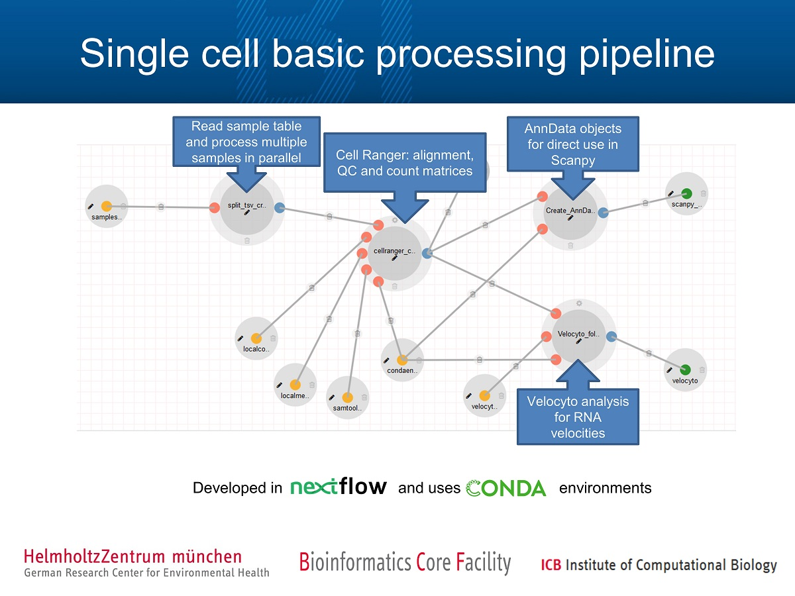

## Why a Lung Cell Atlas scRNAseq pipeline?

The single cell data for the Lung Cell Atlas is generated in a wide variety of centers, at different moments in time, and is preprocessed with different pipelines. For the comprehensive analysis of the Lung Cell Atlas datasets, we would like to process all data in a uniform manner, thus eliminating differences between the datasets due to differences in data processing. Since we often cannot freely share fastq files between centers because of data protection legislation, it is impossible to gather all the sequencing data at one center and run the same pipeline on all data there. Hence we built a stable pipeline with fixed software and versioning that can be easily installed at any institute, on any linux machine, that processes fastqs into count matrices with only one command in the command line. The output count matrices can then be shared, thereby avoiding sharing of private fastqs or bam files. Thus our pipeline will enable harmonization of data processing between research centers for the Lung Cell Atlas.

## Pipeline description
The pipeline has been developed by the [Bioinformatics Core Facility](https://www.helmholtz-muenchen.de/bi) at HMGU using [nextflow](https://www.nextflow.io) and [DolphinNext](https://dolphinnext.readthedocs.io/).  
Nextflow has been developed to create reproducible and transferable computational workflows and supports many executors (e.g. slurm, sge).  
To distribute the tools used by the pipeline, we use the package management system [conda](https://docs.conda.io/en/latest/).  

This pipeline performs basic analysis of sc RNA-Seq data generated using the [10X genomics](https://support.10xgenomics.com/single-cell-gene-expression) protocol.  
It produces gene x cell count matrices using the [Cell Ranger](https://support.10xgenomics.com/single-cell-gene-expression/software/pipelines/latest/what-is-cell-ranger) software. 
In addition matrices for RNA velocity analysis are created using [velocyto](https://velocyto.org/velocyto.py/index.html) and ready to use AnnData objects for [Scanpy](https://scanpy.readthedocs.io) are created.

   

Figure 1: Single cell basic processing pipeline. Shown in the data flow diagram are the main processes of the pipeline. Figure generated by [DolphinNext](https://dolphinnext.readthedocs.io/) .  

The pipeline uses a sample table with the sample information as input.
The individual samples are then processed in parallel.

## How to install and run the pipeline  

The pipeline has been developed and tested on Linux systems. Before getting started, make sure you have miniconda or anaconda installed:

#### Install miniconda:  
The pipeline runs from a conda environment. We therefore need to install conda. The pipeline has been successfully run with conda versions 4.6.14 and 4.7.12.  
Note: You can skip this step if conda is already installed for your user.   
```
$ wget https://repo.anaconda.com/miniconda/Miniconda3-latest-Linux-x86_64.sh  
$ sh Miniconda3-latest-Linux-x86_64.sh
```

#### Required scripts:  
The scripts listed below can be found in the scripts folder of this repo.  
For setting up and testing the pipeline, download the following two bash scripts:  
LCA_pipeline_setup.sh  
LCA_pipeline_testrun.sh  
For running the pipeline on your own data, download the final bash script:  
LCA_pipeline_run.sh  
For uploading to Helholtz secure server:  
cloudsend.sh  
[@LISA @THOMAS: add this script to automatically downloaded files and update path in pipeline scripts!]  
Place the scripts in the directory from where you want to set up and run the pipeline.  

### setting up:  
The first script, LCA_pipeline_setup.sh, will download the files required for the pipeline, 
it will create the needed conda environment with set versioning of the needed software, and finally it will build a reference genome. 
If everything goes well, this should require only one command in your terminal! Once that is done, you are ready to use the pipeline.

Detailed documentation on how to use the script is available under 
```
$ ./LCA_pipeline_setup.sh -h
``` 
We will also give a brief description here. The script allows for a setup of the pipeline with a single command, and requires the following arguments:  
Note: When using the pipeline for the Lung Cell Atlas, please do not change the default settings for -s(pecies), -e(nsembl release) and -g(enome release)! 
- t: number of threads to be used by cellranger (when building reference genome)
- m: memory in Gb to be used by cellranger
- s: species for reference genome 
- e: ensembl release
- g: genome release  
(These flags all have defaults, check the documentation to see the defaults.)  
- c: path to conda envs dir with trailing slash, e.g. /users/doejohn/miniconda3/envs/
- u: user:pass that gives access to the files to be downloaded (this is confidential and must be provided to you by your LCA contact person)

Moreover, the script is modular and it is possible to exclude each of the three parts, e.g. if they were already executed in a previous run. Default is set to true for all three.
- D: when true, include downloading of files
- C: when true, include creation of conda environment
- R: when true, include building of reference genome

Finally, there is an option to include Sars-cov2 in the reference genome:
- S: when true, include Sars-cov2 genome in the reference. Default: false

An example of a command to use (with fake user:pass) is:
```
$ ./LCA_pipeline_setup.sh -t 12 -m 50 -c /home/lisa/miniconda3/envs/ -u 12345a:6789b 
```


### testrun the installed pipeline:  

We made a testrun script "LCA_pipeline_testrun.sh" with a small toy dataset from https://support.10xgenomics.com/single-cell-gene-expression/datasets/3.0.2/5k_pbmc_v3 (downloaded automatically during pipeline setup above) to make sure 
that your pipeline works as expected. The script can be run with only one line in terminal, and should take between half an hour and a few hours to run (depending on your computing power).
It runs the entire pipeline on the toy data,
and includes an option to transfer the output files, exluding .bam and .bai files, to a secure storage at the Helmholtz Center in Munich, Germany.  
[@LISA check this] Note! The script should be run from a secure environment to ensure the file transfer really is secure!

Detailed documentation on how to use the script is available under 
```
$ ./LCA_pipeline_testrun -h
```  
We will also give a brief outline here. The script requires the following arguments:  
- p: "profile" for computation; either 'local' or 'cluster'. Using the 'cluster' profile enables usage of your hpc cluster for a faster run. For further details, check documentation under -h
- e: path to conda environment that was created during pipeline setup, it should have the name "cr3-velocyto-scanpy"
- s: sitename (name of site where data was generated, e.g. SANGER or HELMHOLTZ)
- u: whether to automatically upload output (exluding .bam and .bai files) to Helmholtz storage. Set to either true or false.
- l: the link needed for uploading the output files. It will be provided to you by your LCA contact person.

Optional arguments specifying resources (check default settings in function documentation):  
- c: number of cores for cellranger
- m: memory to be used by cellranger in Gb
- t: number of cores for samtools (should be lower than -c, e.g. half of -c)

Finally, if using profile "cluster", there are some additional arguments to pass. Please read documentation under -h for more information on how to use these arguments.
- q: name of the queue to use
- C: further clusteroptions to pass to the cluster

An example of a full command to use is:  
```
$ ./LCA_pipeline_testrun.sh -p cluster -e /home/lisa/miniconda3/envs/cr3-velocyto-scanpy -s HELMHOLTZ -u true -l https://fake/example/link -c 20 -m 90 -t 10 -q icb_cpu -C 'nice=10000 -t 2:00:00 --qos=icb_stndrd'
``` 
[@LISA add md5sum check here?]

### run the pipeline on your data

Once you have completed the testrun successfully, you can run the pipeline on your own data. This is similar to doing the testrun, except now you'll need to create a tsv (or .xls or tab-separated .txt) file with information about the samples you want to run the pipeline on. An example with one sample is shown [here](docs/example_sample_table.txt). The table should be a tab-separated file containing the samples, one line per sample. The sample header must consist of the following fields.  

* Sample: Name of the sample (must match the names of the fastq files)
* ncells: Estimated number of cells
* fastqpath: Path to directory containing the sequencing reads in fastq format
* refindex: Path to the reference genome index
* refgtf: Path to gtf file describing the gene models (is available in the genome index folder created by Cell Ranger in genes/genes.gtf)
* chemistry: Version of the chemistry (e.g. SC3Pv2 or SC3Pv3, see this [link](https://support.10xgenomics.com/single-cell-gene-expression/software/pipelines/latest/using/count) for more info.)

An example of such is downloaded when running the LCA_pipeline_setup.sh script, and can be found in the thus created sc_processing_cellranger/samplefiles folder. You can also find an example with one sample [in this repo](docs/example_sample_table.txt).

When your table is ready, you can run the LCA_pipeline_run.sh script with only one line of code to run the pipeline on your samples. Detailed documentation on how to use the command can be found under  
```
$ ./LCA_pipeline_run -h
```  
We will give a brief outline of the arguments here as well, partly overlapping with the testrun. Mandatory arguments are:

- p: "profile" for computation; either 'local' or 'cluster'. Using the 'cluster' profile enables usage of your hpc cluster for a faster run. For further details, check documentation under -h
- e: path to conda environment that was created during pipeline setup, it should have the name "cr3-velocyto-scanpy"
- s: sitename (name of site where data was generated, e.g. SANGER or HELMHOLTZ)
- n: dataset name. This name will be added to the output tar file.
- o: name of, or path to the output directory to be used.
- x: path to the sample table file (.tsv, .xls, etc.) that contains the required sample info
- u: whether to automatically upload output (exluding .bam and .bai files) to Helmholtz storage. Set to either true or false.
- l: the link needed for uploading the output files. It will be provided to you by your LCA contact person.

Optional arguments specifying resources (check default settings in function documentation):  
- c: number of cores for cellranger
- m: memory to be used by cellranger in Gb
- t: number of cores for samtools (should be lower than -c, e.g. half of -c)

Finally, if using profile "cluster", there are some additional arguments to pass. Please read documentation under -h for more information on how to use these arguments.
- q: name of the queue to use
- C: further clusteroptions to pass to the cluster

An example of a full command to use is:  
```
$ ./LCA_pipeline_run.sh -p local -e /home/lisa/miniconda3/envs/cr3-velocyto-scanpy -s HELMHOLTZ -n lung_A1_cohort -u true -c 22 -m 80 -t 11 -o outdir_LCA -x "/home/lisa/LCA_pipeline/Samples_testdata_fullrun.txt" -l https://fake/upload/link
``` 
The log of the run will be stored under LCA_pipeline_run.log, in the same folder as where the LCA_pipeline_run.sh is located.

## In case of problems
Submit an issue on this GitHub page.

## License
Toy data for testrun are a subselection from the following 10X dataset: https://support.10xgenomics.com/single-cell-gene-expression/datasets/3.0.2/5k_pbmc_v3  
The Licence for the Cellranger package is included in the local conda package in the tar file.  
The Licence of the nextflow pipeline and the "create_cellranger_ref_from_ensembl.sh" script is available from sc_processing_cellranger/nfpipeline/LICENCE (MIT license)  

